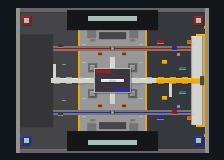

# Lapex Denizen Arsenal and Legends

A broad, data-driven Apex Legends gameplay pack for Paper and Denizen. It
routes the current Season 29 / Overclocked roster: 29 standard guns, the
three genuine legend-specific guns, and all 28 legends with a passive,
tactical, and ultimate.

Lapex is a Minecraft adaptation, not a one-to-one copy. Some powers currently
use documented particle, potion, or movement analogues. Eight complex objects
now use a shared physical deployable system; the remaining particle-only powers
are listed honestly in the legend guide while they are migrated.

## Documentation

- [Player Guide](docs/PLAYER_GUIDE.md)
- [Legend Guide and implementation status](docs/LEGEND_GUIDE.md)
- [Weapon tuning](docs/WEAPON_TUNING.md)
- [Architecture](docs/ARCHITECTURE.md)
- [Deployable design](docs/DEPLOYABLE_DESIGN.md)
- [Testing](docs/TESTING.md)
- [Research and fidelity rules](docs/RESEARCH_AND_FIDELITY.md)
- [Contributing](CONTRIBUTING.md)

## Requirements

- Paper 26.1.2 or newer
- Denizen 1.3.3 (build 7294-DEV or newer)
- No Citizens dependency
- `max-players=10` or higher for a fully human 5v5 match; playtest bots fill
  every combat slot not occupied by a joined Arena player

Copy the repository's `scripts` directory into a subdirectory of
`plugins/Denizen/scripts/`, then reload from the server console or in game:

```text
ex reload scripts_now
ex run lapex_validate
```

The validation task must finish with `32 guns and 28 legends resolved`. It
instantiates every gun and checks every legend record because Denizen defers
some material, mechanism, and data conversions until use.

## Commands

Weapon administration uses `lapex.admin` (operators have it by default):

```text
/lapex list
/lapex give <weapon_id>
/lapex giveall
/lapex refill
/lapex legends
/lapex legend <legend_id>
/lapex setteam <player> <name|clear>
/lapex tactical
/lapex ultimate
/lapex resetcooldowns
/lapex validate
```

`/lapex giveall` grants all 32 guns. Legend selection and use are also
available to every player without an admin permission:

```text
/legend list
/legend <legend_id>
/legend info [legend_id]
/legend tactical
/legend ultimate
/legend status
/legend team <name|clear>
```

Players with the same optional team name are treated as allies by scans,
shields, heals, damage zones, and gunfire. With no team set, only the caster is
an ally. `/lapex setteam` is the authoritative admin path; self-assignment with
`/legend team` requires the separate `lapex.team.manage` permission.

Damaging and scanning legend abilities target enemy players. Neutral movement
devices such as Nitro Gates and Launch Pads remain usable by players from any
team; Lapex guns can also be fired at living entities normally.

## Kings Canyon World

Lapex also includes a Denizen-built, launch-era Kings Canyon combat world. It
is a creative Minecraft adaptation rather than an exact map import: a fixed
640x640 island combines the original north/south layout, western desert,
central river, eastern wetlands and swamp, coastal water, major travel routes,
and recognizable landmark silhouettes.

The repository includes a north-up, one-pixel-per-block
[top-down preview](artifacts/kings_canyon_topdown.png). The release archive also
contains the fully generated Minecraft 26 dimension; follow
[INSTALL.md](INSTALL.md) to deploy it without rebuilding the island.

The registry contains all 17 launch-map destinations:

- `artillery`, `relay`, `slum_lakes`, `pit`, `cascades`, and `wetlands`
- `runoff`, `bunker`, `swamps`, `airbase`, `bridges`, and `hydro_dam`
- `market`, `repulsor`, `skull_town`, `thunderdome`, and `water_treatment`

The five `scripts/lapex_map_*.dsc` files are already included when the entire
repository `scripts` directory is installed as described above. For an
existing selective installation, add these files together before reloading:

```text
scripts/lapex_map_data.dsc
scripts/lapex_map_engine.dsc
scripts/lapex_map_terrain.dsc
scripts/lapex_map_pois_west.dsc
scripts/lapex_map_pois_east.dsc
```

The map tools use `lapex.admin`, the same operator-level permission as the
weapon administration commands:

```text
/lapexmap create
/lapexmap build
/lapexmap build force
/lapexmap status
/lapexmap list
/lapexmap tp staging
/lapexmap tp <poi_id>
/lapexmap validate
/lapexmap rebuild confirm
```

`create` loads the `lapex_kings_canyon` void world and applies its border,
spawn, weather, and anti-griefing rules. `build` constructs terrain first and
then each POI. Terrain units and landmarks are checkpointed separately, so
running `build` again resumes after the last completed unit instead of starting
over. Each completed POI is saved before the next one begins, and edits are
spread across ticks with temporary chunk loading to keep the server responsive.
Run first-time generation during a maintenance window: its 45 ms edit budget
is tuned for finishing the one-time build in several minutes while preserving
checkpointed recovery, not for an already busy production server.

Use `status` to see POI progress, `list` for destination descriptions, and
`tp` from a player to visit either the elevated staging platform or a named
POI. `validate` checks the world, all 17 registry entries and build tasks, map
bounds, and completed destination spawn safety. `build force` clears the map's
versioned checkpoints and regenerates all known geometry; `rebuild confirm`
uses that same full repair path and requires the explicit confirmation word.

Block breaking and placement in this world are cancelled unless the player has
`lapex.map.edit`. Grant that permission only to builders who should be able to
alter Kings Canyon.

The read-only `tools/render_kings_canyon.py` utility renders modern Anvil region
files to the preview PNG and checks for missing or unreadable chunks. It does
not require the Minecraft server to be running.

## Arena Foundry 5v5



Arena Foundry is a separate compact combat world built for round-based 5v5
matches. Its authored floor is about 192 by 144 blocks, with protected north
and south spawns, a two-level center foundry, a west service tunnel, an east
cargo lane and gantry, frequent hard cover, six supply bins, and one central
care box.

Create and validate the map as an operator:

```text
/lapexarena create
/lapexarena build
/lapexarena status
/lapexarena validate
```

Players join a side and choose the gun they receive at the start of each round:

```text
/arena join red
/arena loadout r301
```

An operator starts the match with `/arena start`. Each side always has five
combat slots; native server-controlled gun bots fill every empty slot without
Citizens. Use `/arena status`, `/arena leave`, and `/arena stop` to inspect or
end the session.

Prep lasts 30 seconds. A round ends when one team is eliminated, with no
mid-round respawn. A team wins after at least three round wins and a two-round
lead; round nine is sudden death. The Ring begins closing after 45 seconds.
Right-click the six barrels for team-neutral weapons or healing items, and
contest the yellow center box for three stronger weapons whose pool improves in
later rounds.

This is an Arenas-inspired adaptation, not a one-to-one restoration. It does
not yet include the original material shop, attachment upgrades, downed state,
revives, or purchasable ability charges. See the
[Arenas research record](docs/research/features/arena-5v5-2026-07.md) for the
verified historical rules and intentional changes.

## Controls

- Right-click: fire; hold for automatic fire
- Left-click: toggle ADS zoom and accuracy
- F / swap hands: reload
- Q / drop while holding a Lapex gun: selected legend tactical
- Sneak + Q while holding a Lapex gun: selected legend ultimate
- Sneak + F with Hemlok Breach: fire Breach Charge
- Sneak + F with Sentinel: amp the rifle
- Sneak + F with Rampage: load thermite
- Sneak + F as Ballistic with a Lapex gun offhand: swap the Sling weapon

Q is cancelled for Lapex guns so the held gun is not dropped. Use the
`/legend tactical` and `/legend ultimate` fallbacks when not holding one.
While piloting Crypto's drone, use `/legend tactical` to recall it if the
spectator client does not send a Q/drop packet.

Ammo is stored on each individual item with Denizen item flags. Reloads use an
unlimited reserve so this pack can be dropped into a test range without also
requiring an inventory/ammo economy. Magazine, tactical reload, empty reload,
fire rate, damage, recoil, spread, range, and pellets are editable in
`scripts/apex_weapon_data.dsc`. Item materials and model IDs are in
`scripts/apex_weapon_items.dsc`.

Lapex remaps firing to the carrot-on-a-stick right-click use channel, which the
client repeats while held. The first packet fires one automatic round; a second
packet inside the six-tick probe confirms the hold before continuous fire can
start. Fractional-tick cadence still enforces each gun's configured RPM.
Left-click is a discrete ADS toggle, avoiding unreliable release inference.

Legend cooldowns are stored as expiring player flags, persist through weapon
swaps and legend changes, and can be cleared by an admin with
`/lapex resetcooldowns` while testing. The registry targets Season 29, but
multi-charge powers and values not published in current official notes remain
documented approximations. See the
[legend fidelity audit](docs/research/features/legend-fidelity-audit-2026-07.md).

## Gun Roster

| Class | Weapons |
| --- | --- |
| Assault Rifle | HAVOC, VK-47 Flatline, Hemlok Breach AR, R-301, Nemesis |
| SMG | Alternator, Prowler, R-99, Volt, C.A.R. |
| LMG | Devotion, L-STAR, Spitfire, Rampage |
| Marksman | G7 Scout, Triple Take, 30-30 Repeater, Bocek |
| Sniper | Charge Rifle, Longbow, Kraber, Sentinel |
| Shotgun | EVA-8, Mastiff, Mozambique, Peacekeeper |
| Pistol | RE-45 Burst, P2020, Wingman |
| Legend | Rampart's Sheila, Vantage's A-13 Sentry, Ballistic's Whistler |

This intentionally uses the current **Hemlok Breach AR** and **RE-45 Burst**,
not their retired legacy versions. The current care-package rotation is also
represented in the base tuning for G7 Scout, L-STAR, and Kraber.

## Legend Roster

| Class | Legends |
| --- | --- |
| Assault | Ballistic, Bangalore, Fuse, Mad Maggie, Revenant |
| Skirmisher | Alter, Ash, Axle, Horizon, Octane, Pathfinder, Wraith |
| Recon | Bloodhound, Crypto, Seer, Sparrow, Valkyrie, Vantage |
| Controller | Catalyst, Caustic, Rampart, Wattson |
| Support | Conduit, Gibraltar, Lifeline, Loba, Mirage, Newcastle |

This follows the current roster categories rather than stale character-body
copy: Ash is a Skirmisher, Revenant is Assault, and Valkyrie is Recon. Current
ability names include Ash's Predator's Pursuit, Caustic's Field Research,
Rampart's Modded Loader, and Lifeline's Combat Glide and D.O.C. Halo.

## Distinct Mechanics

- Automatic, semi-automatic, burst, spin-up, and charged trigger paths
- Multi-pellet shotgun patterns, horizontal Mastiff spread, and Triple Take
- Camera-only recoil, hip-fire bloom, toggled ADS zoom/accuracy, head/body/leg hits
- Distance-scaled Charge Rifle damage
- Magazine and shell-by-shell reloads; Bocek automatically nocks its next arrow
- Hemlok Breach Charge with radial falloff and its own cooldown
- Thermite-revved Rampage and shield-cell-amped Sentinel
- Sheila spin-up, 1,200 RPM cap, and Rampart-sized 173-round magazine
- A-13 marks targets, doubles Vantage follow-up damage, grants other guns a 15%
  mark bonus, and regenerates carried rounds in the background
- Whistler has smart-ray aim assist, direct heat tagging, a missed-shot proximity
  field, two rounds, 50 overheat damage, a 15-second heat state, and a temporary jam
- Crypto pilots a visible, damageable 50 HP drone in spectator flight while a
  player-shaped, damageable body remains at the activation point
- Item-scoped Sentinel and Rampage charge state cannot power another copy of the gun

## Legend Mechanics

- Team-aware private recon outlines, heartbeat/track vision, and persistent
  tracker darts, drones, and Exhibit scans
- A voluntary one-way Ash breach, steerable Axle slides and 100 HP Nitro Gates,
  a reusable 200 HP Octane pad with one airborne double jump, and Wraith portals
- Persistent smoke, gas, fire, ferrofluid, fences, electric barricades, healing
  drones, domes, mobile cover, pylons, and D.O.C. Halo zones
- Visible shared-lifecycle models for Caustic traps, Horizon N.E.W.T., Ash
  portals, Octane pads, Axle gates, Gibraltar Dome, Lifeline D.O.C., and Halo
- Two-way Gibraltar Dome shot interception, following D.O.C. healing, Crypto
  body-aware scans/support, and persistent charges for Conduit, Pathfinder, and Octane
- Delayed artillery, missile grids, EMP, Black Hole pull, Motherlode ring,
  Wrecking Ball path, Stinger Bolt blast, and Kickstart displacement
- Weapon integration for Rampart's Modded Loader and Amped Cover, Maggie's
  Warlord's Ire, Ballistic's Tempest, and Wraith's phased attack lock
- Sheila, A-13 Sentry, and Whistler are granted by the matching legend ability,
  only fire for their owning legend, and continue through the same tested firearm
  engine as every standard gun. Loba's Black Market draws only from standard guns

Apex damage is multiplied by `damage_scale: 0.2`, mapping 100 Apex health to 20
Minecraft health. Minecraft armor still reduces projectile damage. All guns are
hitscan at Minecraft scale; the Charge Rifle preserves range scaling visually
and numerically rather than simulating a slow entity projectile.

All guns use `carrot_on_a_stick` for reliable use input and have unique
`custom_model_data` values 1001 through 1032. Eight visual-only device items use
1101 through 1108. Previously issued horse-armor guns are migrated when held
without losing their magazine state.

## Resource Pack

The included `resource-pack` targets Minecraft 26.1.2 resource format 84.0. It
contains 32 low-poly weapon models and eight low-poly legend-device models with
generated palette textures and the needed hand, head, GUI, ground, and fixed
transforms. Install that directory as a client pack, or use the generated
`dist/lapex-resource-pack-26.1.2.zip` archive.

Models and textures are reproducible rather than hand-edited binaries:

```text
python3 tools/build_resource_pack.py
```

The gameplay scripts still work without the pack, using the vanilla
carrot-on-a-stick appearance.

## Scope and Adaptation

The scripts preserve each kit's combat purpose with Minecraft-native movement,
effects, particles, ray traces, and timed zones. Apex-only systems with no
equivalent here, including knockdown shields, death boxes, Ring Consoles, and
care-package scans, use a nearby combat analogue
described by `/legend info`. Crypto's drone uses a real spectator camera and a
damageable player-shaped Paper mannequin. No Citizens dependency or client mod
is required.

Attachments, floor-loot tables, rarity upgrades, reserve-ammo inventory,
optics UI, akimbo rendering, battle-royale rings, Evo upgrades, and a downed
state remain outside this standalone pack. Perk upgrade modifiers are not
applied. Multi-charge storage is implemented for current Conduit, Pathfinder,
and Octane charge rules and replenishes independently across script reloads.

## References

Denizen APIs used by the engine:

- [Item script containers](https://meta.denizenscript.com/Docs/Languages/Item%20Script%20Containers)
- [Inventory command and item flags](https://meta.denizenscript.com/Docs/Commands/Inventory)
- [Push command](https://meta.denizenscript.com/Docs/Commands/Push)
- [Glow command](https://meta.denizenscript.com/Docs/Commands/Glow)
- [Cast command](https://meta.denizenscript.com/Docs/Commands/Cast)
- [Entity drops item event](https://meta.denizenscript.com/Docs/Events/player%20drops%20item)
- [Entity damaged event](https://meta.denizenscript.com/Docs/Events/entity%20damaged)
- [Right-click block/air event](https://meta.denizenscript.com/Docs/Events/player%20right%20clicks%20block)
- [Right-click entity event](https://meta.denizenscript.com/Docs/Events/player%20right%20clicks%20entity)
- [Ray-traced targets](https://meta.denizenscript.com/Docs/Tags/LocationTag.ray_trace_target)
- [Ray-traced impact locations](https://meta.denizenscript.com/Docs/Tags/LocationTag.ray_trace)

Historical Kings Canyon references used for the creative world adaptation:

- [Ultra high-resolution launch map](https://www.reddit.com/r/apexlegends/comments/bwppc0/ultra_high_res_full_map/)
- [2019 Kings Canyon POI guide](https://www.youtube.com/watch?v=mw4xHkwuyJU)
- [Season 0 Kings Canyon tour](https://www.youtube.com/watch?v=aT1hu8IAMbc)
- [Official Apex Legends gameplay deep dive](https://www.youtube.com/watch?v=cEReUkZjjN4)
- [Official Genesis Collection Event trailer](https://www.youtube.com/watch?v=cO0rGsNQ-pw)

Current Apex references:

- [Official mouse and keyboard controls](https://help.ea.com/en/articles/apex-legends/pc-and-controller-settings/)
- [Current weapon and recoil changes](https://www.ea.com/games/apex-legends/apex-legends/news/astral-anomaly-event)
- [Current legend hub](https://www.ea.com/games/apex-legends/apex-legends/characters-hub)
- [Current legend hub, page 2](https://www.ea.com/games/apex-legends/apex-legends/characters-hub?page=2)
- [Crypto character page](https://www.ea.com/games/apex-legends/apex-legends/characters-hub/crypto)
- [Crypto's 30-second drone cooldown update](https://www.ea.com/games/apex-legends/apex-legends/news/shockwave-patch-notes)
- [Overclocked patch notes](https://www.ea.com/games/apex-legends/apex-legends/news/overclocked-patch-notes)
- [Overclocked midseason notes](https://www.ea.com/games/apex-legends/apex-legends/news/overclocked-midseason-patch-notes)
- [Aftershock update: Hemlok and RE-45 Burst](https://www.ea.com/games/apex-legends/apex-legends/news/aftershock-event)
- [Rampart](https://www.ea.com/games/apex-legends/apex-legends/characters-hub/rampart)
- [Vantage](https://www.ea.com/games/apex-legends/apex-legends/characters-hub/vantage)
- [Ballistic](https://www.ea.com/games/apex-legends/apex-legends/characters-hub/ballistic)
